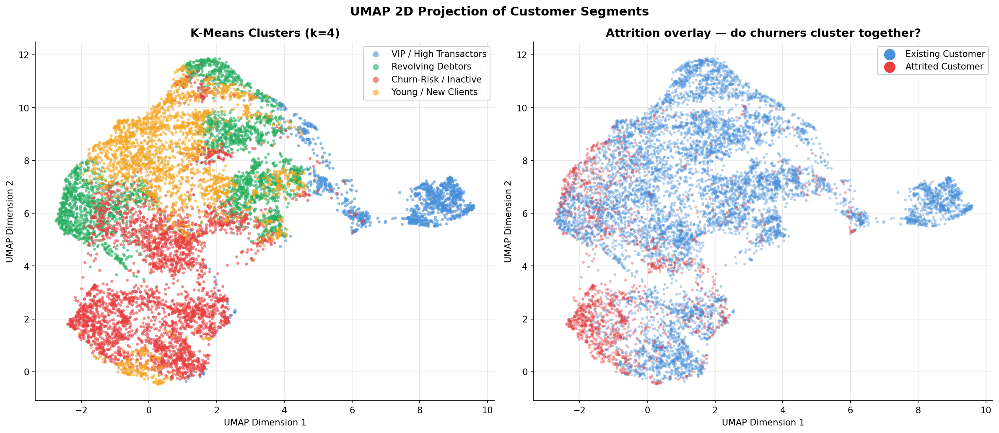
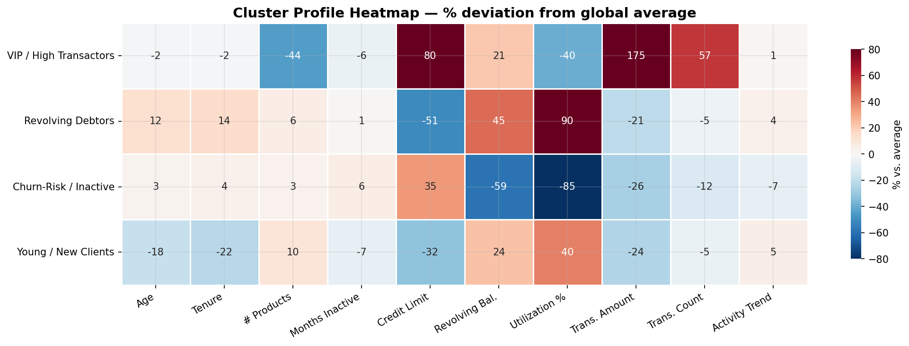
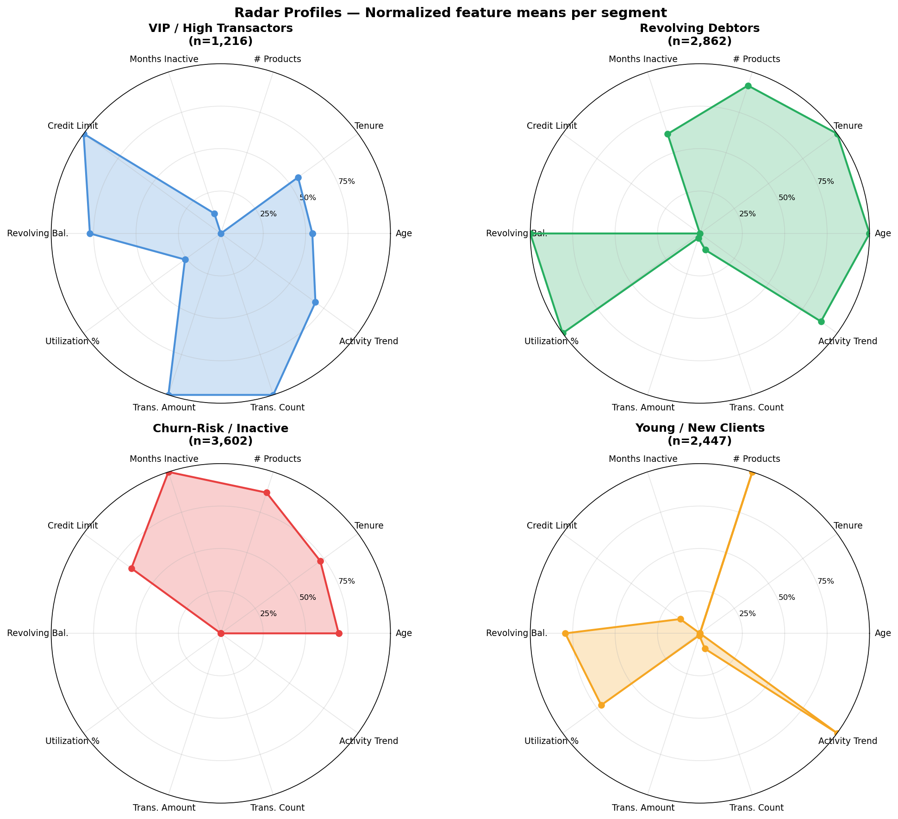
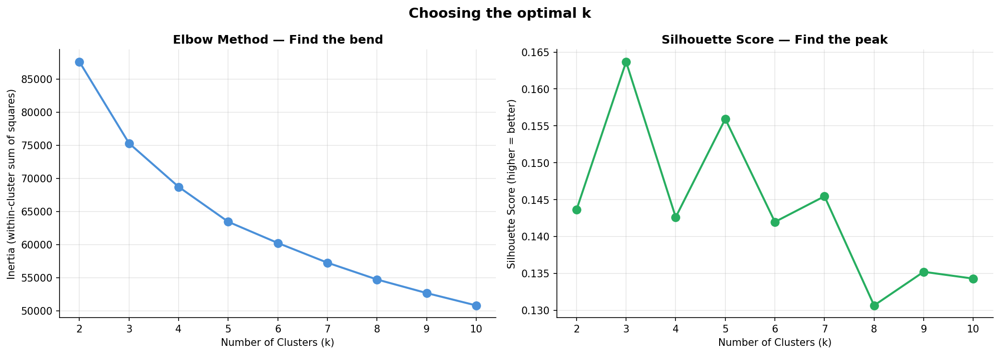

# 🏦 Banking Customer Segmentation
### Unsupervised Machine Learning · K-Means · DBSCAN · PCA · UMAP

> — Grouping 10,127 credit card customers into behaviorally distinct segments using unsupervised learning, and translating each segment into a concrete business strategy.

---

## The Problem

Banks serve millions of customers, but not every customer is the same.
A one-size-fits-all strategy wastes marketing budget on the wrong people and misses
early warning signs of churn.

This project answers: **"Which customers are similar, and what should the bank do differently for each group?"**

---

## The Four Segments Found

| Segment | Size | Churn Rate | Key Signal | Business Priority |
|---|---|---|---|---|
| 🏆 VIP / High Transactors | ~2,500 | **5%** | Trans. Amount +175% vs avg | Retain & upsell |
| 💳 Revolving Debtors | ~2,800 | 9% | Utilization Ratio +89.6% vs avg | Cross-sell & monitor |
| ⚠️ Churn-Risk / Inactive | ~2,400 | **30%** | Trans. Amount −85% vs avg | Immediate intervention |
| 🌱 Young / New Clients | ~2,400 | 12% | Lowest age & tenure | Nurture & educate |

---

## Visual Results

### UMAP Cluster Projection
*Each dot is a customer. Color = cluster. Well-separated blobs confirm the clusters are real.*



### Cluster Profile Heatmap
*Red = above average · Blue = below average. Read each row to understand a segment's personality.*



### Radar Charts — Segment Personalities
*Normalized feature means per cluster — shows the "shape" of each segment at a glance.*



### Elbow + Silhouette — Choosing k=4
*Two metrics agree: k=4 is the optimal number of clusters for this dataset.*



---

## Project Structure

```
banking-customer-segmentation/
│
├── notebook.ipynb                   # Full analysis — run top to bottom
│
├── README.md                        # This file
├── requirements.txt                 # All Python dependencies
│
├── data/
│   └── README.md                    # How to download the dataset from Kaggle
│
├── outputs/
│   ├── customer_segments_output.csv # All customers with cluster labels
│   ├── cluster_profile_means.csv    # Mean features per cluster
│   └── cluster_profile_deviation.csv# % deviation from global average (key table)
│
└── plots/
    ├── 01_distributions.png         # Feature distribution histograms
    ├── 02_correlation.png           # Correlation heatmap
    ├── 03_churn_vs_features.png     # Existing vs Attrited boxplots
    ├── 04_pca_variance.png          # Cumulative explained variance
    ├── 05_elbow_silhouette.png      # Optimal k selection
    ├── 06_cluster_heatmap.png       # Cluster profile heatmap ← most important
    ├── 07_umap.png                  # 2D cluster visualization
    ├── 08_radar_chart.png           # Radar profiles per segment
    └── 09_kdistance.png             # DBSCAN eps selection
```

---


## Methodology

### Feature Engineering
10 behavioral features were selected from 23 available columns.
Demographic columns (gender, education, marital status) were intentionally excluded
from clustering and used only for post-hoc profiling.

| Feature | What it measures |
|---|---|
| `Months_on_book` | Customer tenure — loyalty signal |
| `Total_Relationship_Count` | Number of products held |
| `Months_Inactive_12_mon` | Inactivity — churn early warning |
| `Credit_Limit` | Bank's trust level |
| `Total_Revolving_Bal` | Credit card debt carried |
| `Avg_Utilization_Ratio` | Financial stress signal (0–1) |
| `Total_Trans_Amt` | Total spending volume |
| `Total_Trans_Ct` | Transaction frequency |
| `Total_Ct_Chng_Q4_Q1` | Activity trend (growing or shrinking) |
| `Customer_Age` | Life stage signal |

### Preprocessing
- `StandardScaler` applied to all features before clustering
  (K-Means is distance-based — unscaled features with different ranges distort distances)
- `Attrition_Flag` excluded from features (target variable, not a predictor)
- `CLIENTNUM` excluded (identifier, not behavior)

### Modeling Pipeline

```
Raw data
  └─► Feature selection (10 cols)
        └─► StandardScaler
              └─► PCA (95% variance → 8 components)
                    ├─► UMAP (2D visualization only)
                    └─► K-Means (k=4, chosen by elbow + silhouette)
                          └─► Cluster profiling (groupby + deviation %)
                                └─► Business recommendations
```

**Why K-Means?** Fast, interpretable, and the de-facto baseline for customer segmentation.
k=4 chosen because both the elbow curve and silhouette score agree, and 4 segments
is the maximum a bank team can realistically act on simultaneously.

**Why DBSCAN as well?** Used as a validation step — if DBSCAN finds roughly similar
groupings without being told k, it confirms the clusters are genuine structures in the data,
not artifacts of the algorithm.

### Evaluation

| Metric | Score | Interpretation |
|---|---|---|
| Silhouette Score | see notebook | Target: > 0.4 |
| Davies-Bouldin Score | see notebook | Target: < 1.0 |
| Attrition variance across clusters | 5% – 30% | Large spread = clusters are meaningful |

The 25-percentage-point gap in churn rate between the best and worst cluster is the
strongest evidence the segments are real — random clusters would have similar churn rates.

---

## Business Recommendations Summary

### 🏆 VIP / High Transactors (Churn: 5%)
- Upgrade to Platinum/Infinite card with higher limits
- Assign dedicated relationship manager
- Enrol in high-tier points multiplier program
- Offer airport lounge access and concierge services

### 💳 Revolving Debtors (Churn: 9%)
- Promote instalment plans to manage high balances
- Offer balance transfer with lower interest rate (limited time)
- Cross-sell life/job-loss insurance (they carry financial exposure)
- Monitor `Total_Ct_Chng_Q4_Q1` for sudden drops — early churn signal

### ⚠️ Churn-Risk / Inactive (Churn: 30%) — **Highest priority**
- Immediate re-activation campaign (cashback vouchers, fee waiver)
- Direct phone outreach to understand drop-off reason
- Waive annual fee in exchange for minimum spend over 90 days
- Flag for weekly monitoring by risk team

### 🌱 Young / New Clients (Churn: 12%)
- Promote financial literacy content (credit building, budgeting)
- Offer student or first-job card products
- Push mobile app engagement and digital wallet integrations
- Salary transfer incentive with new-joiner bonus

---

## Dataset

**Credit Card Customers** — Sakshi Goyal, Kaggle  
[https://www.kaggle.com/datasets/sakshigoyal7/credit-card-customers](https://www.kaggle.com/datasets/sakshigoyal7/credit-card-customers)

- 10,127 customers · 23 features
- Includes attrition flag (used for validation, not clustering)
- Real data from a US bank (anonymized)

---

## Tech Stack


```
pandas · numpy · matplotlib · seaborn
scikit-learn (KMeans, DBSCAN, PCA, StandardScaler, metrics)
umap-learn · jupyter
```

---

## Author

**Naira Zaidan**  
Data Scientist  
[LinkedIn](www.linkedin.com/in/naira-zaidan) · [Email](nairatarabia@email.com)
